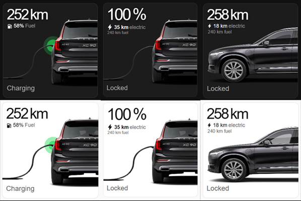
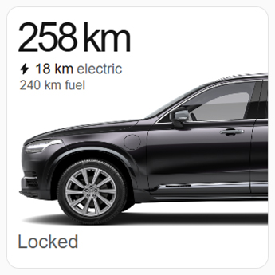
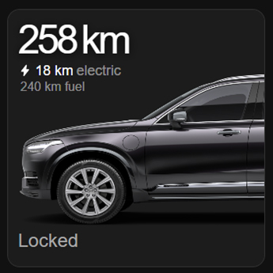
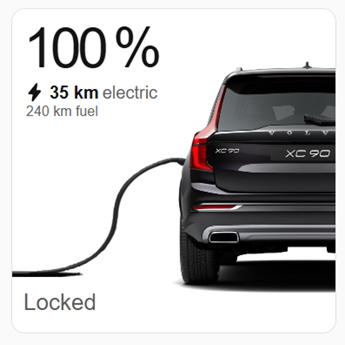
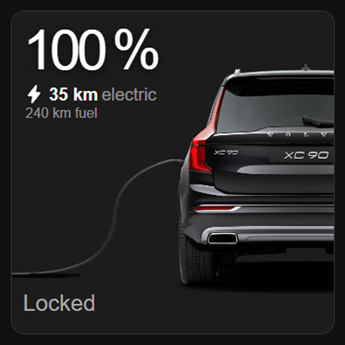
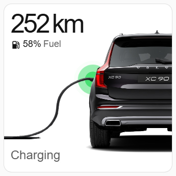
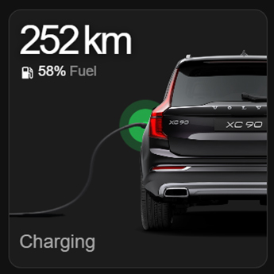

# Volvo Car Card

A [Home Assistant](https://www.home-assistant.io/) Lovelace card for vehicles exposed by the
[Volvo integration](https://www.home-assistant.io/integrations/volvo/), styled after the layout of
the official Volvo app. Works with combustion, plug-in hybrid, and full-electric Volvos — the card
figures out which stats to show based on which entities you give it, so the same card works whether
you drive a gas XC60 or an electric EX30.

The car render is pulled automatically for your specific vehicle from your Volvo account (see
[The image backend](#the-image-backend-required-separately--not-part-of-the-hacs-install) below),
cropped the same way as in the app, alongside a headline range/battery stat, a secondary fuel/
electric stat, lock/charging status text, and (for PHEV/BEV) a charging pulse animation and
charge-cable overlay when plugged in.

## Screenshots



| | Light | Dark |
|---|---|---|
| Parked |  |  |
| Plugged in |  |  |
| Charging |  |  |

## Installation

There are two ways to install the card. Pick whichever you're more comfortable with — both end up
in the same place.

### Option 1: Add as a custom repository (recommended if you have HACS)

1. Open **HACS** in your Home Assistant sidebar, then go to the **Frontend** section.
2. Click the **⋮** menu (top right) → **Custom repositories**.
3. Paste in this repository's URL, set **Category** to `Dashboard`, then click **Add**.
4. Search for **Volvo Car Card** in HACS → Frontend, open it, and click **Download**.
5. Reload your browser tab (or restart Home Assistant) so the new card is picked up.

### Option 2: Add manually (no HACS needed)

1. Download `volvo-car-card.js` from this repository (**Code → Download ZIP**, then unzip, or grab
   the file directly from the [repo](.)).
2. Copy `volvo-car-card.js` into the `www` folder inside your Home Assistant `config` directory
   (create a `www` folder there if it doesn't exist yet — e.g. `config/www/volvo-car-card.js`).
3. In Home Assistant, go to **Settings → Dashboards**, click the **⋮** menu (top right) →
   **Resources**.
4. Click **Add Resource**, set the URL to `/local/volvo-car-card.js` and the type to
   **JavaScript Module**, then click **Create**.

### Add the card to a dashboard

Once installed (via either option above), edit any dashboard, click **Add Card**, choose
**Manual**, and paste in a config like the one below — or add it as `type: custom:volvo-car-card`
directly (see config below).

## Card config

Every entity is optional — **which entities you set determines the vehicle type**:

- Set `battery` + `distance_to_empty_battery` **and** `fuel_amount` + `distance_to_empty_tank` → **hybrid** UI (charging states, fuel + electric sub-stats).
- Set only the battery ones → **BEV** UI (charging states, no fuel line).
- Set only the fuel ones → **ICE** UI (no charging states, no pulse/cable, just range + fuel %).

```yaml
type: custom:volvo-car-card
name: XC90                      # optional label above the header
entities:
  battery: sensor.volvo_xc90_battery
  distance_to_empty_battery: sensor.volvo_xc90_distance_to_empty_battery
  distance_to_empty_tank: sensor.volvo_xc90_distance_to_empty_tank
  fuel_amount: sensor.volvo_xc90_fuel_amount
  fuel_tank_capacity_l: 50          # static number — no HA entity for this
  charging_connection_status: sensor.volvo_xc90_charging_connection_status
  charging_status: sensor.volvo_xc90_charging_status
  lock: lock.volvo_xc90_lock
  location: device_tracker.volvo_xc90_location
  start_climatisation: button.volvo_xc90_start_climatisation   # optional — adds a climate button to the tap dialog
  stop_climatisation: button.volvo_xc90_stop_climatisation      # optional — needed to turn climate back off
images:
  exterior_back: sensor.volvo_xc90_images        # entity whose `exterior_back` attribute holds a URL
  exterior_side_left: sensor.volvo_xc90_images    # entity whose `exterior_side_left` attribute holds a URL
  fallback: /local/assets/volvo-xc90.png          # shown if the attribute is empty
```

For an EV, just drop the `fuel_amount` / `distance_to_empty_tank` / `fuel_tank_capacity_l` keys.
For a gas-only car, drop the `battery` / `distance_to_empty_battery` /
`charging_connection_status` / `charging_status` keys.

Entity IDs are never hardcoded in the card — HA generates them per-vehicle/per-account, so they're
always config, not code. This also means the card works with more than one Volvo: add one card
instance per vehicle, each pointing at that vehicle's own entities.

Tapping the card opens a small dialog with a lock toggle (shown when `lock` is set) and a climate
toggle (shown when either `start_climatisation` or `stop_climatisation` is set — the Volvo
integration exposes these as momentary `button.*` entities, not a single on/off switch, so the card
tracks the on/off state itself and presses whichever button matches).

## The image backend (required separately — not part of the HACS install)

The Volvo integration can hand back a signed, temporary render URL for your car
(`volvo.get_image_url`), but a Lovelace card is pure frontend JS — it can't call HA service actions,
so it can't fetch that image itself. That has to happen in your own `configuration.yaml` (or a
packages file), once, and the card just reads whatever URL/path the result ends up at.

**Known issue: server-side downloading gets blocked (HTTP 403).** Volvo's image CDN
(`cas.volvocars.com`) sits behind Akamai bot protection. HA's own `downloader.download_file`
action (and `curl` from the HA host) gets rejected with a 403 from `AkamaiGHost`, even though the
exact same URL opens fine in a real browser. This isn't a bug in this card or in `volvo.get_image_url`
— the URL is valid, but Akamai fingerprints the *request*, not just the URL, and HA's backend HTTP
client doesn't look enough like a browser to pass. **Don't route the image through
`downloader.download_file`** — it will fail for most users.

### Recommended: point the card straight at the live URL

Have your template sensor expose the raw signed URL as an attribute, and point the card's `images`
config directly at it. The image then loads in the *browser* viewing your dashboard, which is a real
browser and isn't blocked by Akamai — and the browser's normal HTTP cache means it isn't
re-fetched from Volvo on every dashboard load anyway, just when the cache expires or the URL
changes.

```yaml
template:
  - trigger:
      - trigger: homeassistant
        event: start
      - trigger: time_pattern
        hours: "/12"   # re-pull periodically in case Volvo rotates the signed URL
    action:
      - action: volvo.get_image_url
        data:
          entry: <VOLVO_CONFIG_ENTRY_ID>
          images:
            - exterior_back
            - exterior_side_left
        response_variable: volvo_images
    sensor:
      - name: "Volvo Images"
        unique_id: volvo_images
        state: "ok"
        attributes:
          exterior_back: >-
            {{ volvo_images.images | selectattr('type','eq','exterior_back') | map(attribute='url') | first | default('') }}
          exterior_side_left: >-
            {{ volvo_images.images | selectattr('type','eq','exterior_side_left') | map(attribute='url') | first | default('') }}
```

```yaml
images:
  exterior_back: sensor.volvo_images
  exterior_side_left: sensor.volvo_images
  fallback: /local/assets/volvo-xc90.png
```

Notes:
- `volvo.get_image_url` returns `{"images": [{"type": "exterior_back", "url": "..."}, ...]}` — a
  list keyed by `type`, not a flat dict.
- The URL is signed and time-limited, so re-pulling periodically (not just on HA start) keeps it
  from going stale — the `time_pattern` trigger above does this every 12 hours; adjust to taste.

### Alternative: a fully static, manually-downloaded image

If you'd rather not depend on Volvo's servers at dashboard-load time at all — e.g. for a fully
offline dashboard, or if your browser is *also* blocked by Akamai for some reason — you can fetch
the render once by hand and serve it as a static file instead:

1. Call `volvo.get_image_url` once from **Developer Tools → Actions** in HA (or use the template
   above and check the resulting sensor's attributes) to get the current signed URL.
2. Open that URL in a normal desktop browser tab and save the image (right-click → Save Image As).
3. Copy the saved file into `config/www/assets/`, e.g.
   `config/www/assets/volvo-xc90-exterior-back.png`.
4. Point the card at it directly as a plain path — no entity needed:
   ```yaml
   images:
     exterior_back: /local/assets/volvo-xc90-exterior-back.png
   ```

Since this is a manual, one-time step, you'll need to repeat it if you ever want a fresher render
(e.g. after a repaint/respec in your Volvo account) — the URL itself doesn't need to be re-fetched
automatically since you're no longer depending on it after the download.

If you don't want to set any of this up, just omit `images` from the card config (or point
`fallback` at a static image you host yourself) — everything else still works.

## Development

```
npm install
npm run build     # outputs volvo-car-card.js at the repo root
npm run watch      # rebuild on change
```
